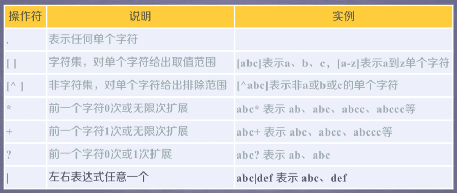
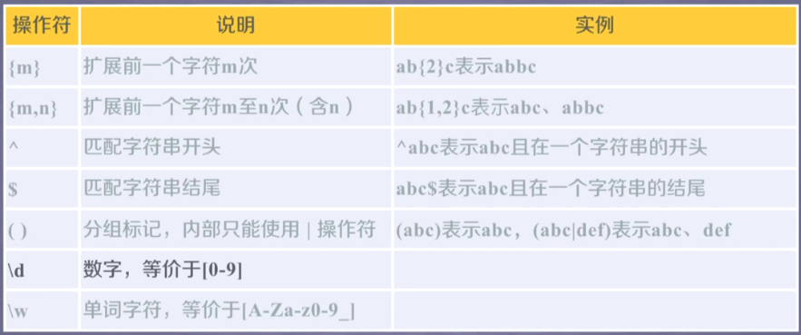

# Regulation Expression








- $\mathrm{P}(\mathrm{Y}|\mathrm{YT}| \mathrm{YTH} \mid \mathrm{YTHO}) ? \mathrm{N}$

​            'PN'、'PYN'、'PYTN', 'PYTHN'、'PYTHON'

- PYTHON+              'PYTHON' 、'PYTHONN' 、'PYTHONNN' ...

- $\wedge[A-Z a-z]+\$$              any letter
- $\wedge[A-Z a-z 1-9]+\$$
- ^-?\d+$          Integer


$\begin{array}{ll}\text { 0-99: }[1-9] ? \backslash d & 100-199: & 1 \backslash d\{2\} \\ 200-249: & 2[0-4] \backslash d & 250-255: & 25[0-5]\end{array}$


```python
import re
r'text' # raw string 
```


### 最小匹配

在匹配后加上问号（？）代表最小匹配

- *?
- ??
- +?