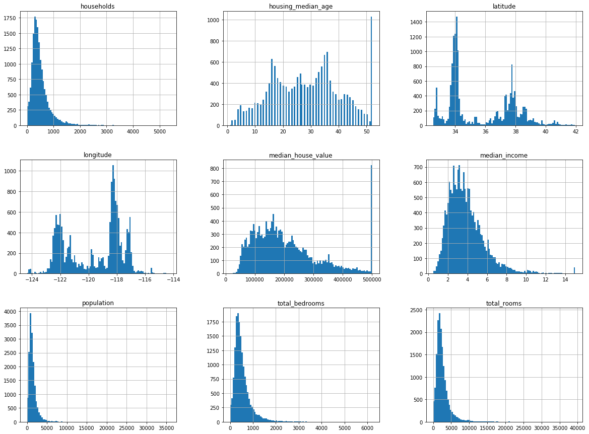
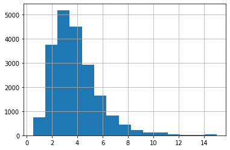
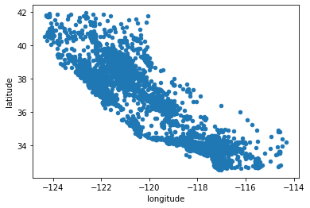
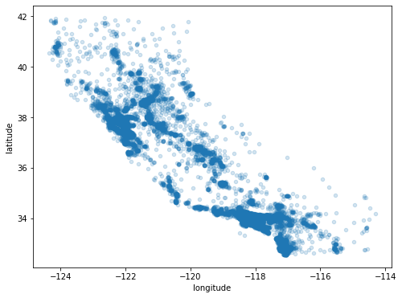
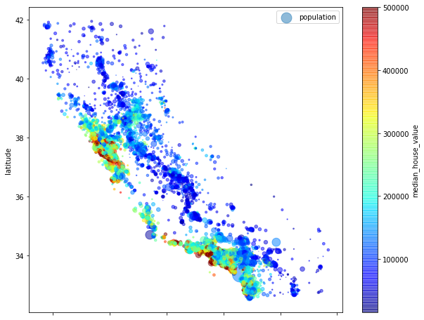
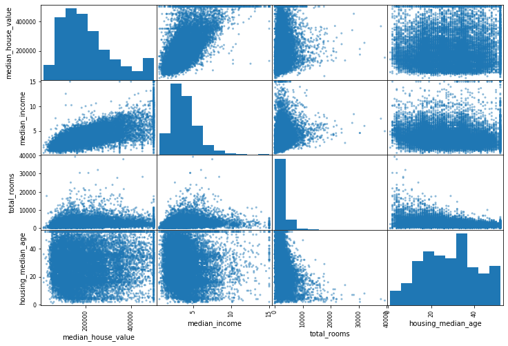
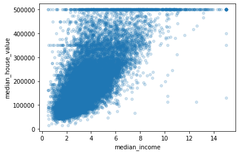

# Calfornia Housing price

### Downloading the data
When we get the data, we get a file in the tgz form
So we nee d extract tgz file


```python
import os
import tarfile
from six.moves import urllib

HOUSING_PATH = "datasets\\housing"

```


```python
DOWNLOAD_ROOT = "https://raw.githubusercontent.com/ageron/handson-ml/master/"
HOUSING_URL = DOWNLOAD_ROOT + HOUSING_PATH + "\\housing.tgz"
def fetch_housing_data(housing_url=HOUSING_URL, housing_path=HOUSING_PATH):
    if not os.path.isdir(housing_path):
        os.makedirs(housing_path)
        tgz_path = os.path.join(housing_path, "housing.tgz")
        urllib.request.urlretrieve(housing_url, tgz_path)
        # extract tgz file
        housing_tgz = tarfile.open(tgz_path)
        housing_tgz.extractall(path=housing_path)
        housing_tgz.close()
    
fetch_housing_data()
```

### Loading csv file
> use pandas to load csv file


```python
import pandas as pd
def load_housing_data(housing_path=HOUSING_PATH):
    csv_path = os.path.join(housing_path, "housing.csv")
    return pd.read_csv(csv_path)
```


```python
housing = load_housing_data()
housing.head()
```


<div>
<style scoped>
    .dataframe tbody tr th:only-of-type {
        vertical-align: middle;
    }

    .dataframe tbody tr th {
        vertical-align: top;
    }

    .dataframe thead th {
        text-align: right;
    }
</style>
<table border="1" class="dataframe">
  <thead>
    <tr style="text-align: right;">
      <th></th>
      <th>longitude</th>
      <th>latitude</th>
      <th>housing_median_age</th>
      <th>total_rooms</th>
      <th>total_bedrooms</th>
      <th>population</th>
      <th>households</th>
      <th>median_income</th>
      <th>median_house_value</th>
      <th>ocean_proximity</th>
    </tr>
  </thead>
  <tbody>
    <tr>
      <th>0</th>
      <td>-122.23</td>
      <td>37.88</td>
      <td>41.0</td>
      <td>880.0</td>
      <td>129.0</td>
      <td>322.0</td>
      <td>126.0</td>
      <td>8.3252</td>
      <td>452600.0</td>
      <td>NEAR BAY</td>
    </tr>
    <tr>
      <th>1</th>
      <td>-122.22</td>
      <td>37.86</td>
      <td>21.0</td>
      <td>7099.0</td>
      <td>1106.0</td>
      <td>2401.0</td>
      <td>1138.0</td>
      <td>8.3014</td>
      <td>358500.0</td>
      <td>NEAR BAY</td>
    </tr>
    <tr>
      <th>2</th>
      <td>-122.24</td>
      <td>37.85</td>
      <td>52.0</td>
      <td>1467.0</td>
      <td>190.0</td>
      <td>496.0</td>
      <td>177.0</td>
      <td>7.2574</td>
      <td>352100.0</td>
      <td>NEAR BAY</td>
    </tr>
    <tr>
      <th>3</th>
      <td>-122.25</td>
      <td>37.85</td>
      <td>52.0</td>
      <td>1274.0</td>
      <td>235.0</td>
      <td>558.0</td>
      <td>219.0</td>
      <td>5.6431</td>
      <td>341300.0</td>
      <td>NEAR BAY</td>
    </tr>
    <tr>
      <th>4</th>
      <td>-122.25</td>
      <td>37.85</td>
      <td>52.0</td>
      <td>1627.0</td>
      <td>280.0</td>
      <td>565.0</td>
      <td>259.0</td>
      <td>3.8462</td>
      <td>342200.0</td>
      <td>NEAR BAY</td>
    </tr>
  </tbody>
</table>
</div>


```python
housing.info()
```

    <class 'pandas.core.frame.DataFrame'>
    RangeIndex: 20640 entries, 0 to 20639
    Data columns (total 10 columns):
     #   Column              Non-Null Count  Dtype  
    ---  ------              --------------  -----  
     0   longitude           20640 non-null  float64
     1   latitude            20640 non-null  float64
     2   housing_median_age  20640 non-null  float64
     3   total_rooms         20640 non-null  float64
     4   total_bedrooms      20433 non-null  float64
     5   population          20640 non-null  float64
     6   households          20640 non-null  float64
     7   median_income       20640 non-null  float64
     8   median_house_value  20640 non-null  float64
     9   ocean_proximity     20640 non-null  object 
    dtypes: float64(9), object(1)
    memory usage: 1.6+ MB
    

- All the attributes are numerical except `ocean_proximity`.
And it is probably a catogries attribute. And we can use `value_counts` to find out


```python
housing["ocean_proximity"].value_counts()
```


    <1H OCEAN     9136
    INLAND        6551
    NEAR OCEAN    2658
    NEAR BAY      2290
    ISLAND           5
    Name: ocean_proximity, dtype: int64


- And we can also look at the numerical attributes


```python
housing.describe()
```


<div>
<style scoped>
    .dataframe tbody tr th:only-of-type {
        vertical-align: middle;
    }

    .dataframe tbody tr th {
        vertical-align: top;
    }

    .dataframe thead th {
        text-align: right;
    }
</style>
<table border="1" class="dataframe">
  <thead>
    <tr style="text-align: right;">
      <th></th>
      <th>longitude</th>
      <th>latitude</th>
      <th>housing_median_age</th>
      <th>total_rooms</th>
      <th>total_bedrooms</th>
      <th>population</th>
      <th>households</th>
      <th>median_income</th>
      <th>median_house_value</th>
    </tr>
  </thead>
  <tbody>
    <tr>
      <th>count</th>
      <td>20640.000000</td>
      <td>20640.000000</td>
      <td>20640.000000</td>
      <td>20640.000000</td>
      <td>20433.000000</td>
      <td>20640.000000</td>
      <td>20640.000000</td>
      <td>20640.000000</td>
      <td>20640.000000</td>
    </tr>
    <tr>
      <th>mean</th>
      <td>-119.569704</td>
      <td>35.631861</td>
      <td>28.639486</td>
      <td>2635.763081</td>
      <td>537.870553</td>
      <td>1425.476744</td>
      <td>499.539680</td>
      <td>3.870671</td>
      <td>206855.816909</td>
    </tr>
    <tr>
      <th>std</th>
      <td>2.003532</td>
      <td>2.135952</td>
      <td>12.585558</td>
      <td>2181.615252</td>
      <td>421.385070</td>
      <td>1132.462122</td>
      <td>382.329753</td>
      <td>1.899822</td>
      <td>115395.615874</td>
    </tr>
    <tr>
      <th>min</th>
      <td>-124.350000</td>
      <td>32.540000</td>
      <td>1.000000</td>
      <td>2.000000</td>
      <td>1.000000</td>
      <td>3.000000</td>
      <td>1.000000</td>
      <td>0.499900</td>
      <td>14999.000000</td>
    </tr>
    <tr>
      <th>25%</th>
      <td>-121.800000</td>
      <td>33.930000</td>
      <td>18.000000</td>
      <td>1447.750000</td>
      <td>296.000000</td>
      <td>787.000000</td>
      <td>280.000000</td>
      <td>2.563400</td>
      <td>119600.000000</td>
    </tr>
    <tr>
      <th>50%</th>
      <td>-118.490000</td>
      <td>34.260000</td>
      <td>29.000000</td>
      <td>2127.000000</td>
      <td>435.000000</td>
      <td>1166.000000</td>
      <td>409.000000</td>
      <td>3.534800</td>
      <td>179700.000000</td>
    </tr>
    <tr>
      <th>75%</th>
      <td>-118.010000</td>
      <td>37.710000</td>
      <td>37.000000</td>
      <td>3148.000000</td>
      <td>647.000000</td>
      <td>1725.000000</td>
      <td>605.000000</td>
      <td>4.743250</td>
      <td>264725.000000</td>
    </tr>
    <tr>
      <th>max</th>
      <td>-114.310000</td>
      <td>41.950000</td>
      <td>52.000000</td>
      <td>39320.000000</td>
      <td>6445.000000</td>
      <td>35682.000000</td>
      <td>6082.000000</td>
      <td>15.000100</td>
      <td>500001.000000</td>
    </tr>
  </tbody>
</table>
</div>


we can also plot the histogram for each numerical attribute


```python
%matplotlib inline 
# only in jupyter notebook
import matplotlib.pyplot as plt
housing.hist(bins = 100, figsize=(20,15)) # figure size #bin : the number of the catogories
plt.show()
```





### Create a Test Set

Create a test set: pick some examples randomly, approximately 20% of the dataset


```python
import numpy as np

def split_train_test(data, test_ratio):
    random_indices = np.random.permutation(len(data))
    test_set_size = int( len(data) * test_ratio)
    test_indices = random_indices[:test_set_size]
    train_indices = random_indices[test_set_size:]
    return data.iloc[train_indices], data.iloc[test_indices]
```


```python
train_set, test_set = split_train_test(housing, 0.2)
print(len(train_set), "train +", len(test_set), "test", len(test_set)/len(housing))
```

    16512 train + 4128 test 0.2
    

> We got some problem using the method above
> that is when every time we apply the funciton, it generates different data

So we can generate random indices in the first time.

But if the dataset is updated?

One common way is using each instance's identifier to descide whether or not it should go in the test set


```python
import hashlib

def test_set_check(identifier, test_ratio, hash):
    return hash(np.int64(identifier)).digest()[-1] < 256 * test_ratio # the last byte of the md5 < 256 * ratio


def split_train_test_id(data, test_ratio, id_column, hash=hashlib.md5):
    ids = data[id_column]
    in_test_set = ids.apply(lambda id_: test_set_check(id_, test_ratio, hash)) # apply each id[i] to the funciton
    # lambda : anomynous function
    return data.loc[~in_test_set], data.loc[in_test_set]
```

Since the dataset do not have identifier column, we can set row index as ID:


```python
housing_with_id = housing.reset_index() # add index column
housing_with_id["index"].head()
```


    0    0
    1    1
    2    2
    3    3
    4    4
    Name: index, dtype: int64


However, using index as indentier, we have to make sure that new data could only be added at the end of the dataset and no row ever get deleted.

Since the latitude and longitude for a city won't change for a short period, we can set them as identifier


```python
housing_with_id["id"] = housing["longitude"] * 1000 +  housing["latitude"]
housing_with_id["id"].head()
train_set, test_set = split_train_test_id(housing_with_id, 0.2, "id")
```


```python
from sklearn.model_selection import train_test_split
train_set, test_set = train_test_split(housing, test_size=0.2, random_state=42) # done by skilt-learn
```


```python
housing["median_income"].hist(bins = 15)
```


    <matplotlib.axes._subplots.AxesSubplot at 0x1f15e6437f0>





To sample test set and training set according to the meadian income, we first generated categories through meadian_income from each city


```python
housing["income_cat"] = np.ceil(housing["median_income"] / 1.5)
housing["income_cat"].where(housing["income_cat"] < 5, 5.0, inplace=True)
# make catogries which is greater than 5 merge into 5
```

Now using stratified sampling based on the income categries


```python
from sklearn.model_selection import StratifiedShuffleSplit

split = StratifiedShuffleSplit(n_splits = 1, test_size = 0.2, random_state = 42)
for train_index, test_index in split.split(housing, housing["income_cat"]):
    strat_train_set = housing.loc[train_index]
    strat_test_set = housing.loc[test_index]
    
# To see the proportion of each categories
housing["income_cat"].value_counts() /len(housing)
```


    3.0    0.350581
    2.0    0.318847
    4.0    0.176308
    5.0    0.114438
    1.0    0.039826
    Name: income_cat, dtype: float64


Then remove column income_categories


```python
for set in (strat_train_set, strat_test_set):
    set.drop(["income_cat"], axis = 1, inplace = True)
```

## Exporing the data and visualize the data

For not harming the training set, let's copy the data


```python
housing = strat_train_set.copy()
```

### Visualizing geographical data


```python
housing.plot(kind = "scatter", x = "longitude", y = "latitude") # scatter means discrete point
```


    <matplotlib.axes._subplots.AxesSubplot at 0x1785b2ebbe0>





```python
housing.plot(kind = "scatter", x = "longitude", y = "latitude", alpha=0.2,
            figsize = (8,6)) # alpha shows the density
```


    <matplotlib.axes._subplots.AxesSubplot at 0x17856ba2be0>





Now we are goint to plot a figure that can show the density by the radius of each circle, price by the color

> using predifeined color map `jet` which ranges from blue to red


```python
housing.plot(kind = "scatter", x = "longitude", y= "latitude", alpha = 0.5,
            s = housing["population"]/80, label = "population",
            c = "median_house_value", cmap = plt.get_cmap("jet"), colorbar = True,
            figsize = (10,8))
plt.legend()
```


    <matplotlib.legend.Legend at 0x1785baaaf28>





### Looking for Correlations


```python
corr_matrix = housing.corr()
```

Looking at each attribute correlates with the median house value:


```python
corr_matrix["median_house_value"].sort_values(ascending = False)
```


    median_house_value    1.000000
    median_income         0.687160
    total_rooms           0.135097
    housing_median_age    0.114110
    households            0.064506
    total_bedrooms        0.047689
    population           -0.026920
    longitude            -0.047432
    latitude             -0.142724
    Name: median_house_value, dtype: float64


Another way to check correlation is check every numerical attribute agianst every other attribute.

There are 11 numerical attributes, we would get 121 plots which would not fit on a page. So we would use the data that most correlated with the median housing price


```python
housing.columns.tolist()
```


    ['longitude',
     'latitude',
     'housing_median_age',
     'total_rooms',
     'total_bedrooms',
     'population',
     'households',
     'median_income',
     'median_house_value',
     'ocean_proximity']


```python
from pandas.plotting import scatter_matrix

attributes = ["median_house_value", "median_income", "total_rooms", "housing_median_age"]
scatter_matrix(housing[attributes], figsize=(12,8))
```


    array([[<matplotlib.axes._subplots.AxesSubplot object at 0x000001F15E3496D8>,
            <matplotlib.axes._subplots.AxesSubplot object at 0x000001F15E453EF0>,
            <matplotlib.axes._subplots.AxesSubplot object at 0x000001F15E42D390>,
            <matplotlib.axes._subplots.AxesSubplot object at 0x000001F15E422908>],
           [<matplotlib.axes._subplots.AxesSubplot object at 0x000001F15E66CEB8>,
            <matplotlib.axes._subplots.AxesSubplot object at 0x000001F15E5C54A8>,
            <matplotlib.axes._subplots.AxesSubplot object at 0x000001F15E999A58>,
            <matplotlib.axes._subplots.AxesSubplot object at 0x000001F15ECC0080>],
           [<matplotlib.axes._subplots.AxesSubplot object at 0x000001F15ECC00B8>,
            <matplotlib.axes._subplots.AxesSubplot object at 0x000001F15E96ABA8>,
            <matplotlib.axes._subplots.AxesSubplot object at 0x000001F15E555198>,
            <matplotlib.axes._subplots.AxesSubplot object at 0x000001F15EC64630>],
           [<matplotlib.axes._subplots.AxesSubplot object at 0x000001F15EC6CBA8>,
            <matplotlib.axes._subplots.AxesSubplot object at 0x000001F15E12C198>,
            <matplotlib.axes._subplots.AxesSubplot object at 0x000001F15E11B748>,
            <matplotlib.axes._subplots.AxesSubplot object at 0x000001F15E1C7CF8>]],
          dtype=object)





The most correlated attribute is median income, let's look closely


```python
housing.plot(kind = "scatter", x = "median_income", y = "median_house_value", alpha = 0.2)
```


    <matplotlib.axes._subplots.AxesSubplot at 0x1f15e1e1fd0>





### Attribute Combinations

the total number of rooms in a district is not very useful if we don’t know how many
households there are. 

What we really want is the number of rooms per household.

Similaryly, the totao numer of bedrooms by itself is not useful.


```python
housing["rooms_per_household"] = housing["total_rooms"]/housing["households"]
housing["bedrooms_per_room"] = housing["total_bedrooms"]/housing["total_rooms"]
housing["population_per_household"]=housing["population"]/housing["households"]
```

Let's look the correlation of the new matrix


```python
corr_matrix = housing.corr()
corr_matrix["median_house_value"].sort_values(ascending = False)
```


    median_house_value          1.000000
    median_income               0.687160
    rooms_per_household         0.146285
    total_rooms                 0.135097
    housing_median_age          0.114110
    households                  0.064506
    total_bedrooms              0.047689
    population_per_household   -0.021985
    population                 -0.026920
    longitude                  -0.047432
    latitude                   -0.142724
    bedrooms_per_room          -0.259984
    Name: median_house_value, dtype: float64


## Prepare the Data for Machine Learning


First we copy the data, and let the data become labels and non-labels


```python
housing = strat_train_set.drop("median_house_value", axis = 1)
housing_labels = strat_train_set["median_house_value"].copy()
housing.head()
```


<div>
<style scoped>
    .dataframe tbody tr th:only-of-type {
        vertical-align: middle;
    }

    .dataframe tbody tr th {
        vertical-align: top;
    }

    .dataframe thead th {
        text-align: right;
    }
</style>
<table border="1" class="dataframe">
  <thead>
    <tr style="text-align: right;">
      <th></th>
      <th>longitude</th>
      <th>latitude</th>
      <th>housing_median_age</th>
      <th>total_rooms</th>
      <th>total_bedrooms</th>
      <th>population</th>
      <th>households</th>
      <th>median_income</th>
      <th>ocean_proximity</th>
    </tr>
  </thead>
  <tbody>
    <tr>
      <th>17606</th>
      <td>-121.89</td>
      <td>37.29</td>
      <td>38.0</td>
      <td>1568.0</td>
      <td>351.0</td>
      <td>710.0</td>
      <td>339.0</td>
      <td>2.7042</td>
      <td>&lt;1H OCEAN</td>
    </tr>
    <tr>
      <th>18632</th>
      <td>-121.93</td>
      <td>37.05</td>
      <td>14.0</td>
      <td>679.0</td>
      <td>108.0</td>
      <td>306.0</td>
      <td>113.0</td>
      <td>6.4214</td>
      <td>&lt;1H OCEAN</td>
    </tr>
    <tr>
      <th>14650</th>
      <td>-117.20</td>
      <td>32.77</td>
      <td>31.0</td>
      <td>1952.0</td>
      <td>471.0</td>
      <td>936.0</td>
      <td>462.0</td>
      <td>2.8621</td>
      <td>NEAR OCEAN</td>
    </tr>
    <tr>
      <th>3230</th>
      <td>-119.61</td>
      <td>36.31</td>
      <td>25.0</td>
      <td>1847.0</td>
      <td>371.0</td>
      <td>1460.0</td>
      <td>353.0</td>
      <td>1.8839</td>
      <td>INLAND</td>
    </tr>
    <tr>
      <th>3555</th>
      <td>-118.59</td>
      <td>34.23</td>
      <td>17.0</td>
      <td>6592.0</td>
      <td>1525.0</td>
      <td>4459.0</td>
      <td>1463.0</td>
      <td>3.0347</td>
      <td>&lt;1H OCEAN</td>
    </tr>
  </tbody>
</table>
</div>


There are some missing values in total_bedrooms, so they are three options:
- Get rid of the corresponding cistricts
- Get rid of the whole attribute
- Set the values to some value (zero, the mean, the median, etc.)


```python
housing.dropna(subset=["total_bedrooms"]) # option 1
housing.drop("total_bedrooms", axis = 1)  # option 2
median = housing["total_bedrooms"].median()
housing["total_bedrooms"].fillna(median)  # option 3
```


    17606     351.0
    18632     108.0
    14650     471.0
    3230      371.0
    3555     1525.0
              ...  
    6563      236.0
    12053     294.0
    13908     872.0
    11159     380.0
    15775     682.0
    Name: total_bedrooms, Length: 16512, dtype: float64


If option 3 is chosen, we need save `median`

sklearn apply a function Imputer instance


```python
from sklearn.preprocessing import Imputer
 
imputer = Imputer(strategy = "median")

housing_num = housing.drop("ocean_proximity", axis = 1) # drop the non numerical attributes
```

    C:\Users\Archibald Chain\AppData\Roaming\Python\Python37\site-packages\sklearn\utils\deprecation.py:66: DeprecationWarning: Class Imputer is deprecated; Imputer was deprecated in version 0.20 and will be removed in 0.22. Import impute.SimpleImputer from sklearn instead.
      warnings.warn(msg, category=DeprecationWarning)
    


```python
# fit the imputer instance to the training data using the fit() method:
imputer.fit(housing_num)
imputer.statistics_ 

```


    array([-118.51  ,   34.26  ,   29.    , 2119.5   ,  433.    , 1164.    ,
            408.    ,    3.5409])


```python
X = imputer.transform(housing_num)
housing_tr = pd.DataFrame(X, columns = housing_num.columns)
```

## Handling Text and Categorical Atrributes

Since the categories attributes are all in the 'string' type, we should turn every type into a catogories.


```python
from sklearn.preprocessing import LabelEncoder
encoder = LabelEncoder()
housing_cat = housing["ocean_proximity"]
housing_cat_encoded = encoder.fit_transform(housing_cat)
housing_cat_encoded
```


    array([0, 0, 4, ..., 1, 0, 3])


```python
encoder.classes_
```


    array(['<1H OCEAN', 'INLAND', 'ISLAND', 'NEAR BAY', 'NEAR OCEAN'],
          dtype=object)


However, the suitable solution should be giving 0 and 1 for each categories


```python
from sklearn.preprocessing import OneHotEncoder
encoder = OneHotEncoder()
housing_cat_1hot = encoder.fit_transform(housing_cat_encoded.reshape(-1,1))
housing_cat_1hot
```

    C:\Users\Archibald Chain\AppData\Roaming\Python\Python37\site-packages\sklearn\preprocessing\_encoders.py:415: FutureWarning: The handling of integer data will change in version 0.22. Currently, the categories are determined based on the range [0, max(values)], while in the future they will be determined based on the unique values.
    If you want the future behaviour and silence this warning, you can specify "categories='auto'".
    In case you used a LabelEncoder before this OneHotEncoder to convert the categories to integers, then you can now use the OneHotEncoder directly.
      warnings.warn(msg, FutureWarning)
    


    <16512x5 sparse matrix of type '<class 'numpy.float64'>'
    	with 16512 stored elements in Compressed Sparse Row format>


The output a Scipy sparse matrix, instead of Numpy array. This is useful when with thousands of categorical attributes with thousands of categories


```python
housing_cat_1hot.toarray()
```


    array([[1., 0., 0., 0., 0.],
           [1., 0., 0., 0., 0.],
           [0., 0., 0., 0., 1.],
           ...,
           [0., 1., 0., 0., 0.],
           [1., 0., 0., 0., 0.],
           [0., 0., 0., 1., 0.]])


- We can apply both transformations (from text categories to integer categories, then
from integer categories to one-hot vectors) in one shot using the  LabelBinarizer
class: 


```python
from sklearn.preprocessing import LabelBinarizer
encoder = LabelBinarizer( sparse_output=True) # parameter true, it generate spares categories.
housing_cat_1hot = encoder.fit_transform(housing_cat)
housing_cat_1hot
```


    <16512x5 sparse matrix of type '<class 'numpy.int32'>'
    	with 16512 stored elements in Compressed Sparse Row format>


### Custom Transformer

We can construct our own custom transformer

- with TransformerMixin, we get fit_transformer() 
- with BaseEstimator, we get set_parameter() and get_parameter()


```python
from sklearn.base import BaseEstimator, TransformerMixin

rooms_ix, bedrooms_ix, population_ix, household_ix = 3, 4, 5, 6
class CombinedAttributesAdder(BaseEstimator, TransformerMixin):
    def __init__(self, add_bedrooms_per_room = True):
        self.add_bedrooms_per_room = add_bedrooms_per_room
    def fit(self, X, y = None):
        return self
    def transform(self, X, y = None): # we get a numpy matrix rather than a pandas DataFrame
        rooms_per_household = X[:, 3]/ X[:, household_ix]
        population_per_household = X[:, population_ix] / X[:, bedrooms_ix]
        if self.add_bedrooms_per_room:
            bedrooms_per_room = X[:, rooms_ix]/ X[:,bedrooms_ix]
            return np.c_[X, rooms_per_household, population_per_household, 
                               bedrooms_per_room]
        else:
            return np.c_[X, rooms_per_household, population_per_household]
        
attr_adder = CombinedAttributesAdder(add_bedrooms_per_room=True)
housing_extra_attribs = attr_adder.transform(housing.values) 
housing_extra_attribs
```


    array([[-121.89, 37.29, 38.0, ..., 4.625368731563422, 2.022792022792023,
            4.467236467236467],
           [-121.93, 37.05, 14.0, ..., 6.008849557522124, 2.8333333333333335,
            6.287037037037037],
           [-117.2, 32.77, 31.0, ..., 4.225108225108225, 1.9872611464968153,
            4.144373673036093],
           ...,
           [-116.4, 34.09, 9.0, ..., 6.34640522875817, 2.4059633027522938,
            5.567660550458716],
           [-118.01, 33.82, 31.0, ..., 5.50561797752809, 3.568421052631579,
            5.157894736842105],
           [-122.45, 37.77, 52.0, ..., 4.843505477308295, 1.8607038123167154,
            4.538123167155425]], dtype=object)


```python
class DataFrameSelector(BaseEstimator, TransformerMixin):
    def __init__(self, attribute_names):
        self.attribute_names = attribute_names
    def fit(self,X, y = None):
        return self
    def transform(self, X):
        return X[self.attribute_names].values
```

### Featuring Scaling

Two method to do it  min-max scaling and standardization:
- Min-max scaling (many people call this normalization) is quite simple: values are
shifted and rescaled so that they end up ranging from 0 to 1.


- Standardization is quite different: first it subtracts the mean value (so standardized
values always have a zero mean), and then it divides by the variance so that the result‐
ing distribution has unit variance. 

###  Transfomation Pipline


```python
from sklearn.pipeline import Pipeline
from sklearn.preprocessing import StandardScaler
num_pipeline = Pipeline([
    ('imputer', Imputer(strategy="median")),
    ('attribs_adder', CombinedAttributesAdder()),
    ('std_scaler', StandardScaler()),
        ])
housing_num_tr = num_pipeline.fit_transform(housing_num)
```

    C:\Users\Archibald Chain\AppData\Roaming\Python\Python37\site-packages\sklearn\utils\deprecation.py:66: DeprecationWarning: Class Imputer is deprecated; Imputer was deprecated in version 0.20 and will be removed in 0.22. Import impute.SimpleImputer from sklearn instead.
      warnings.warn(msg, category=DeprecationWarning)
    

When call FeautreUnion's  it runs each transformer’s  `transform()` method in parallel, waits for
their output, and then concatenates them and returns the result


> In the latest version of sklearn, there are some problems  when using pipeline on LabelBinarizer
> 
> LabelBinarizer  fit_transform() only have two parameters, while pipeline thought it has three
>
> Solution given by stack over flow is add a custom LabelBinarizer 


```python
from sklearn.base import TransformerMixin #gives fit_transform method for free
class MyLabelBinarizer(TransformerMixin):
    def __init__(self):
        self.encoder = LabelBinarizer()
    def fit(self, x, y=0):
        return self
    def transform(self, x, y=0):
        return self.encoder.fit_transform(x)
```

> Howver, using the LabelBinarizer above is still a problem.
>
> We can using the following way to solve it 


```python
from sklearn.base import TransformerMixin #gives fit_transform method for free
class MyLabelBinarizer2(TransformerMixin):
    def __init__(self, sparser_output = False):
        self.encoder1 = LabelEncoder()
        self.encoder2 = OneHotEncoder()#categories='auto')
        self.sparser_output = False
    def fit(self, x, y=0):
        return self
    def transform(self, x, y=0):
        encoded = self.encoder1.fit_transform(housing_cat)
        if self.sparser_output:
            return self.encoder2.fit_transform(encoded.reshape(-1,1))
        else:
            return self.encoder2.fit_transform(encoded.reshape(-1,1)).toarray()
```


```python
from sklearn.pipeline import FeatureUnion

num_attribs = list(housing_num)  # return string index of each column as a list
cat_attribs = ["ocean_proximity"]

num_pipeline = Pipeline([
    ('selector', DataFrameSelector(num_attribs)),
    ('imputer', Imputer(strategy="median")),            #defined previous
    ('attribs_adder', CombinedAttributesAdder()),       # defined previous
    ('std_scaler', StandardScaler())
])
cat_pipeline = Pipeline([
    ('selector', DataFrameSelector(num_attribs)),
    ('label_binarizer', MyLabelBinarizer2())
])
full_pipeline = FeatureUnion(transformer_list=[
    ("num_pipeline", num_pipeline),
    ("cat_pipline", cat_pipeline)
])
```

    C:\Users\Archibald Chain\AppData\Roaming\Python\Python37\site-packages\sklearn\utils\deprecation.py:66: DeprecationWarning: Class Imputer is deprecated; Imputer was deprecated in version 0.20 and will be removed in 0.22. Import impute.SimpleImputer from sklearn instead.
      warnings.warn(msg, category=DeprecationWarning)
    


```python
# To apply the pipeline
housing_prepared = full_pipeline.fit_transform(housing)

```

    C:\Users\Archibald Chain\AppData\Roaming\Python\Python37\site-packages\sklearn\preprocessing\_encoders.py:415: FutureWarning: The handling of integer data will change in version 0.22. Currently, the categories are determined based on the range [0, max(values)], while in the future they will be determined based on the unique values.
    If you want the future behaviour and silence this warning, you can specify "categories='auto'".
    In case you used a LabelEncoder before this OneHotEncoder to convert the categories to integers, then you can now use the OneHotEncoder directly.
      warnings.warn(msg, FutureWarning)
    


```python
housing_prepared
```


    array([[-1.15604281,  0.77194962,  0.74333089, ...,  0.        ,
             0.        ,  0.        ],
           [-1.17602483,  0.6596948 , -1.1653172 , ...,  0.        ,
             0.        ,  0.        ],
           [ 1.18684903, -1.34218285,  0.18664186, ...,  0.        ,
             0.        ,  1.        ],
           ...,
           [ 1.58648943, -0.72478134, -1.56295222, ...,  0.        ,
             0.        ,  0.        ],
           [ 0.78221312, -0.85106801,  0.18664186, ...,  0.        ,
             0.        ,  0.        ],
           [-1.43579109,  0.99645926,  1.85670895, ...,  0.        ,
             1.        ,  0.        ]])


## Training and Evaluating on the Training Set

#### Linear Regression Model


```python
from sklearn.linear_model import LinearRegression

lin_reg = LinearRegression()
lin_reg.fit(housing_prepared, housing_labels)
```


    LinearRegression(copy_X=True, fit_intercept=True, n_jobs=None, normalize=False)


Let's try it out on few instances


```python
some_data = housing.iloc[:]
some_data = np.array(list(some_data))
some_labels = housing_labels.iloc[:5]
some_data_prepared = full_pipeline.transform(some_data)
print("Predictions:\t", lin_reg.predict(some_data_prepared))
print("Labels:\t\t", list(some_labels))
```

    C:\Users\Archibald Chain\AppData\Roaming\Python\Python37\site-packages\ipykernel_launcher.py:7: FutureWarning: Using a non-tuple sequence for multidimensional indexing is deprecated; use `arr[tuple(seq)]` instead of `arr[seq]`. In the future this will be interpreted as an array index, `arr[np.array(seq)]`, which will result either in an error or a different result.
      import sys
    


    ---------------------------------------------------------------------------

    IndexError                                Traceback (most recent call last)

    <ipython-input-219-343b2027d11d> in <module>
          2 some_data = np.array(list(some_data))
          3 some_labels = housing_labels.iloc[:5]
    ----> 4 some_data_prepared = full_pipeline.transform(some_data)
          5 print("Predictions:\t", lin_reg.predict(some_data_prepared))
          6 print("Labels:\t\t", list(some_labels))
    

    ~\AppData\Roaming\Python\Python37\site-packages\sklearn\pipeline.py in transform(self, X)
        958         Xs = Parallel(n_jobs=self.n_jobs)(
        959             delayed(_transform_one)(trans, X, None, weight)
    --> 960             for name, trans, weight in self._iter())
        961         if not Xs:
        962             # All transformers are None
    

    ~\AppData\Roaming\Python\Python37\site-packages\joblib\parallel.py in __call__(self, iterable)
        919             # remaining jobs.
        920             self._iterating = False
    --> 921             if self.dispatch_one_batch(iterator):
        922                 self._iterating = self._original_iterator is not None
        923 
    

    ~\AppData\Roaming\Python\Python37\site-packages\joblib\parallel.py in dispatch_one_batch(self, iterator)
        757                 return False
        758             else:
    --> 759                 self._dispatch(tasks)
        760                 return True
        761 
    

    ~\AppData\Roaming\Python\Python37\site-packages\joblib\parallel.py in _dispatch(self, batch)
        714         with self._lock:
        715             job_idx = len(self._jobs)
    --> 716             job = self._backend.apply_async(batch, callback=cb)
        717             # A job can complete so quickly than its callback is
        718             # called before we get here, causing self._jobs to
    

    ~\AppData\Roaming\Python\Python37\site-packages\joblib\_parallel_backends.py in apply_async(self, func, callback)
        180     def apply_async(self, func, callback=None):
        181         """Schedule a func to be run"""
    --> 182         result = ImmediateResult(func)
        183         if callback:
        184             callback(result)
    

    ~\AppData\Roaming\Python\Python37\site-packages\joblib\_parallel_backends.py in __init__(self, batch)
        547         # Don't delay the application, to avoid keeping the input
        548         # arguments in memory
    --> 549         self.results = batch()
        550 
        551     def get(self):
    

    ~\AppData\Roaming\Python\Python37\site-packages\joblib\parallel.py in __call__(self)
        223         with parallel_backend(self._backend, n_jobs=self._n_jobs):
        224             return [func(*args, **kwargs)
    --> 225                     for func, args, kwargs in self.items]
        226 
        227     def __len__(self):
    

    ~\AppData\Roaming\Python\Python37\site-packages\joblib\parallel.py in <listcomp>(.0)
        223         with parallel_backend(self._backend, n_jobs=self._n_jobs):
        224             return [func(*args, **kwargs)
    --> 225                     for func, args, kwargs in self.items]
        226 
        227     def __len__(self):
    

    ~\AppData\Roaming\Python\Python37\site-packages\sklearn\pipeline.py in _transform_one(transformer, X, y, weight, **fit_params)
        693 
        694 def _transform_one(transformer, X, y, weight, **fit_params):
    --> 695     res = transformer.transform(X)
        696     # if we have a weight for this transformer, multiply output
        697     if weight is None:
    

    ~\AppData\Roaming\Python\Python37\site-packages\sklearn\pipeline.py in _transform(self, X)
        538         Xt = X
        539         for _, _, transform in self._iter():
    --> 540             Xt = transform.transform(Xt)
        541         return Xt
        542 
    

    <ipython-input-66-2a3b4f0f19d9> in transform(self, X)
          5         return self
          6     def transform(self, X):
    ----> 7         return X[self.attribute_names].values
    

    IndexError: only integers, slices (`:`), ellipsis (`...`), numpy.newaxis (`None`) and integer or boolean arrays are valid indices


```python
from sklearn.metrics import mean_squared_error
housing_predictions = lin_reg.predict(housing_prepared)
lin_rmse = mean_squared_error(housing_labels, housing_predictions)
lin_rmse
```


    4723628725.279794


#### Decession Tree Regression


```python
from sklearn.tree import DecisionTreeRegressor

tree_reg = DecisionTreeRegressor()
tree_reg.fit(housing_prepared, housing_labels)
```


    DecisionTreeRegressor(criterion='mse', max_depth=None, max_features=None,
                          max_leaf_nodes=None, min_impurity_decrease=0.0,
                          min_impurity_split=None, min_samples_leaf=1,
                          min_samples_split=2, min_weight_fraction_leaf=0.0,
                          presort=False, random_state=None, splitter='best')


```python
housing_predictions = tree_reg.predict(housing_prepared)
tree_mse = mean_squared_error(housing_labels, housing_predictions)
tree_mse = np.sqrt(tree_mse)
tree_mse
```


    0.0


## Using Cross-Validation

We don't want to touch the test set until we are ready launch a model that we are very confident.

So we can use `train_test_split` to split the training set into a smaller training set and a validation set, then train the model against the smaller training set and evaluate them against the validation set.

K-fold cross-validation: it randomly splits the training set into 10 distinct
subsets called folds, then train the Decision Tree Model 10 times. picking a different fold for evaluation every time and training on the other 9 folds.
The result is an array containing 10 evaluation error:


```python
from sklearn.model_selection import cross_val_score
tree_scores = cross_val_score(tree_reg, housing_prepared, housing_labels, scoring = "neg_mean_squared_error", cv = 10)
tree_rmse_scores = np.sqrt(-tree_scores)
```


```python
def display_scores(scores):
    print("Scores:", scores)
    print("Mean:", scores.mean())
    print("Standard deviation:", scores.std())
    
display_scores(tree_rmse_scores)
```

    Scores: [69050.64876384 65660.63657415 75056.13197538 74405.72582172
     75109.89210238 71037.39765743 69461.54545119 69014.78516735
     74549.56823219 71807.09541249]
    Mean: 71515.34271581142
    Standard deviation: 3068.4773994700613
    


```python
lin_scores = cross_val_score(lin_reg, housing_prepared, housing_labels, scoring = "neg_mean_squared_error", cv = 10)
lin_rmse_scores = np.sqrt(-lin_scores)
display_scores(lin_rmse_scores)
```

    Scores: [67017.10226888 67116.66376981 68070.49102354 74774.53394933
     68465.44788446 71478.52891582 65132.61122812 68494.45813594
     71953.12890783 67969.53501985]
    Mean: 69047.25011035803
    Standard deviation: 2703.5105098669956
    

It seems the Linear Regression Model performs better than Decision Tree Model. That's true, The decession Tree model is overfitting so badly.

#### Random Forest Model


```python
from sklearn.ensemble import RandomForestRegressor
forest_reg = RandomForestRegressor()
forest_reg.fit(housing_prepared, housing_labels)
forest_rmse = mean_squared_error(housing_labels, forest_reg.predict(housing_prepared))
forest_rmse = np.sqrt(forest_rmse)
forest_rmse
```

    C:\Users\Archibald Chain\AppData\Roaming\Python\Python37\site-packages\sklearn\ensemble\forest.py:245: FutureWarning: The default value of n_estimators will change from 10 in version 0.20 to 100 in 0.22.
      "10 in version 0.20 to 100 in 0.22.", FutureWarning)
    


    22826.619828397306


```python
forest_scores = cross_val_score(forest_reg, housing_prepared, housing_labels, scoring = "neg_mean_squared_error", cv = 10)
forest_rmse_scores = np.sqrt(-forest_scores)
```


    array([52886.91087803, 50029.92959489, 52265.17651867, 55219.16916582,
           53784.50474138, 56045.76721275, 51640.28748997, 51755.10523981,
           55944.04380411, 53207.74971784])


```python
display_scores(forest_rmse_scores)
```

    Scores: [52886.91087803 50029.92959489 52265.17651867 55219.16916582
     53784.50474138 56045.76721275 51640.28748997 51755.10523981
     55944.04380411 53207.74971784]
    Mean: 53277.864436327225
    Standard deviation: 1884.8867018860176
    

##### Now we need to save the model


```python
from sklearn.externals import joblib

joblib.dump(forest_reg, "my_model.pkl")
```


    ['my_model.pkl']


```python
forest_reg = joblib.load("my_model.pkl")
```

### Fine-Tune Model

### Grid Search


```python
from sklearn.model_selection import GridSearchCV

param_grid = [
    {'n_estimators':[3,10,30], 'max_features':[2,4,6, 8]},
    {'bootstrap':[False], 'n_estimators':[3,10], 'max_features':[2,3,4]},
]

forest_reg = RandomForestRegressor()
grid_search = GridSearchCV(forest_reg, param_grid, cv = 5, scoring = 'neg_mean_squared_error')

grid_search.fit(housing_prepared, housing_labels)
```


    GridSearchCV(cv=5, error_score='raise-deprecating',
                 estimator=RandomForestRegressor(bootstrap=True, criterion='mse',
                                                 max_depth=None,
                                                 max_features='auto',
                                                 max_leaf_nodes=None,
                                                 min_impurity_decrease=0.0,
                                                 min_impurity_split=None,
                                                 min_samples_leaf=1,
                                                 min_samples_split=2,
                                                 min_weight_fraction_leaf=0.0,
                                                 n_estimators='warn', n_jobs=None,
                                                 oob_score=False, random_state=None,
                                                 verbose=0, warm_start=False),
                 iid='warn', n_jobs=None,
                 param_grid=[{'max_features': [2, 4, 6, 8],
                              'n_estimators': [3, 10, 30]},
                             {'bootstrap': [False], 'max_features': [2, 3, 4],
                              'n_estimators': [3, 10]}],
                 pre_dispatch='2*n_jobs', refit=True, return_train_score=False,
                 scoring='neg_mean_squared_error', verbose=0)


```python
final_model = grid_search.best_estimator_
```

### Evaluate system on Test Set


```python
X_test
```


<div>
<style scoped>
    .dataframe tbody tr th:only-of-type {
        vertical-align: middle;
    }

    .dataframe tbody tr th {
        vertical-align: top;
    }

    .dataframe thead th {
        text-align: right;
    }
</style>
<table border="1" class="dataframe">
  <thead>
    <tr style="text-align: right;">
      <th></th>
      <th>longitude</th>
      <th>latitude</th>
      <th>housing_median_age</th>
      <th>total_rooms</th>
      <th>total_bedrooms</th>
      <th>population</th>
      <th>households</th>
      <th>median_income</th>
      <th>ocean_proximity</th>
    </tr>
  </thead>
  <tbody>
    <tr>
      <th>5241</th>
      <td>-118.39</td>
      <td>34.12</td>
      <td>29.0</td>
      <td>6447.0</td>
      <td>1012.0</td>
      <td>2184.0</td>
      <td>960.0</td>
      <td>8.2816</td>
      <td>&lt;1H OCEAN</td>
    </tr>
    <tr>
      <th>10970</th>
      <td>-117.86</td>
      <td>33.77</td>
      <td>39.0</td>
      <td>4159.0</td>
      <td>655.0</td>
      <td>1669.0</td>
      <td>651.0</td>
      <td>4.6111</td>
      <td>&lt;1H OCEAN</td>
    </tr>
    <tr>
      <th>20351</th>
      <td>-119.05</td>
      <td>34.21</td>
      <td>27.0</td>
      <td>4357.0</td>
      <td>926.0</td>
      <td>2110.0</td>
      <td>876.0</td>
      <td>3.0119</td>
      <td>&lt;1H OCEAN</td>
    </tr>
    <tr>
      <th>6568</th>
      <td>-118.15</td>
      <td>34.20</td>
      <td>52.0</td>
      <td>1786.0</td>
      <td>306.0</td>
      <td>1018.0</td>
      <td>322.0</td>
      <td>4.1518</td>
      <td>INLAND</td>
    </tr>
    <tr>
      <th>13285</th>
      <td>-117.68</td>
      <td>34.07</td>
      <td>32.0</td>
      <td>1775.0</td>
      <td>314.0</td>
      <td>1067.0</td>
      <td>302.0</td>
      <td>4.0375</td>
      <td>INLAND</td>
    </tr>
    <tr>
      <th>...</th>
      <td>...</td>
      <td>...</td>
      <td>...</td>
      <td>...</td>
      <td>...</td>
      <td>...</td>
      <td>...</td>
      <td>...</td>
      <td>...</td>
    </tr>
    <tr>
      <th>20519</th>
      <td>-121.53</td>
      <td>38.58</td>
      <td>33.0</td>
      <td>4988.0</td>
      <td>1169.0</td>
      <td>2414.0</td>
      <td>1075.0</td>
      <td>1.9728</td>
      <td>INLAND</td>
    </tr>
    <tr>
      <th>17430</th>
      <td>-120.44</td>
      <td>34.65</td>
      <td>30.0</td>
      <td>2265.0</td>
      <td>512.0</td>
      <td>1402.0</td>
      <td>471.0</td>
      <td>1.9750</td>
      <td>NEAR OCEAN</td>
    </tr>
    <tr>
      <th>4019</th>
      <td>-118.49</td>
      <td>34.18</td>
      <td>31.0</td>
      <td>3073.0</td>
      <td>674.0</td>
      <td>1486.0</td>
      <td>684.0</td>
      <td>4.8984</td>
      <td>&lt;1H OCEAN</td>
    </tr>
    <tr>
      <th>12107</th>
      <td>-117.32</td>
      <td>33.99</td>
      <td>27.0</td>
      <td>5464.0</td>
      <td>850.0</td>
      <td>2400.0</td>
      <td>836.0</td>
      <td>4.7110</td>
      <td>INLAND</td>
    </tr>
    <tr>
      <th>2398</th>
      <td>-118.91</td>
      <td>36.79</td>
      <td>19.0</td>
      <td>1616.0</td>
      <td>324.0</td>
      <td>187.0</td>
      <td>80.0</td>
      <td>3.7857</td>
      <td>INLAND</td>
    </tr>
  </tbody>
</table>
<p>4128 rows × 9 columns</p>
</div>


```python
X_test = strat_test_set.drop("median_house_value", axis = 1)
X_test_cat = X_test["ocean_proximity"]
X_test_num = X_test.drop("ocean_proximity", axis = 1)

X_test_num_array = num_pipeline.fit_transform(X_test_num)

myLabelBinarizer = MyLabelBinarizer()
X_test_cat_array = myLabelBinarizer.fit_transform(X_test_cat)
y_test = strat_test_set["median_house_value"].copy()


X_test_prepared = np.hstack((X_test_num_array, X_test_cat_array))

```

    (4128, 11)
    


```python
final_predictions = final_model.predict(X_test_prepared)
final_mse = mean_squared_error(y_test, final_predictions)
final_rmse = np.sqrt(final_mse) 
```


```python
final_rmse
```


    64692.9060362774


